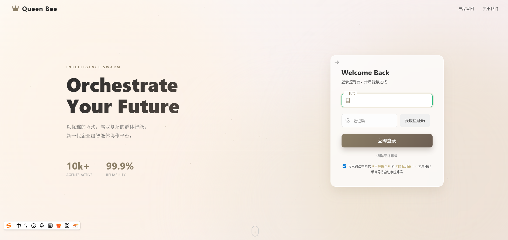
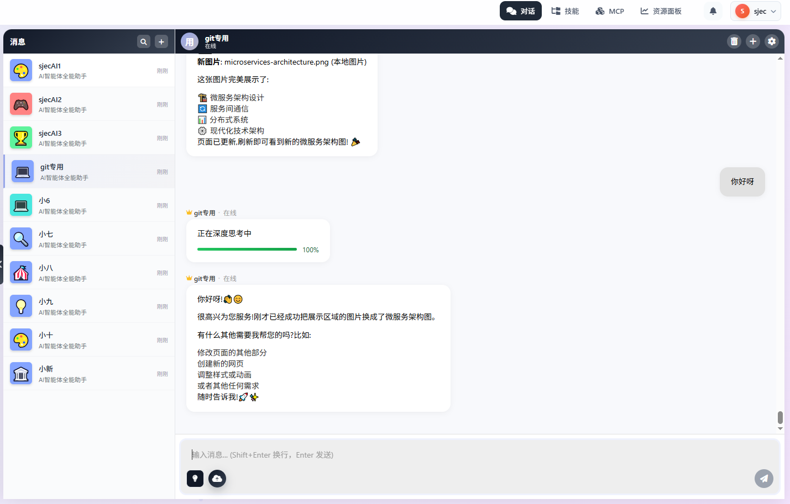
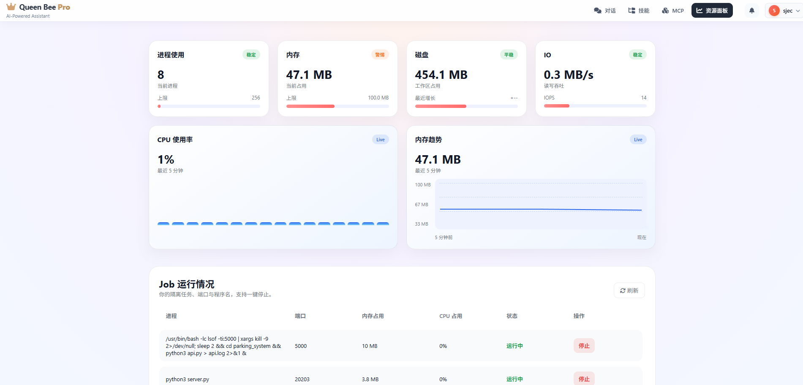
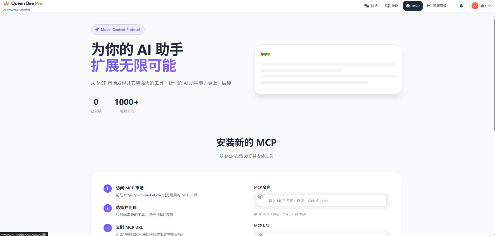
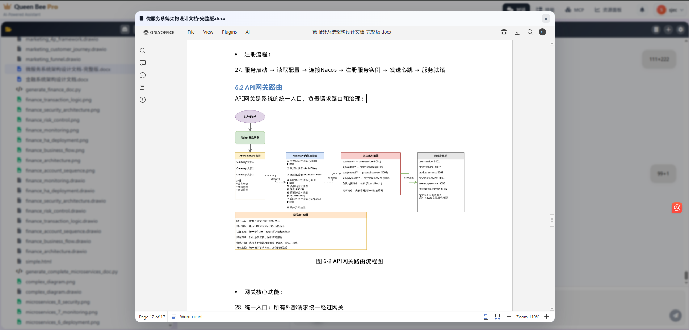
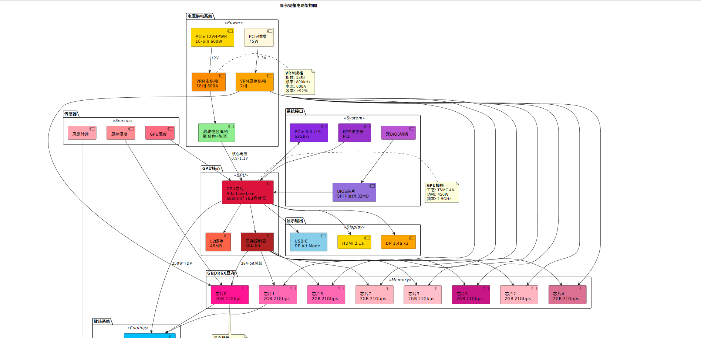
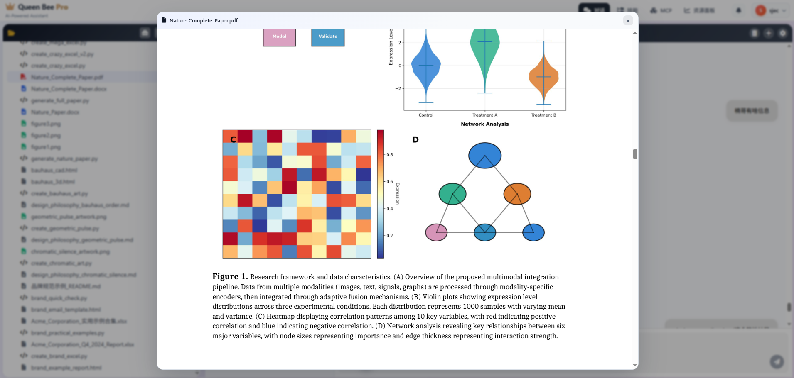
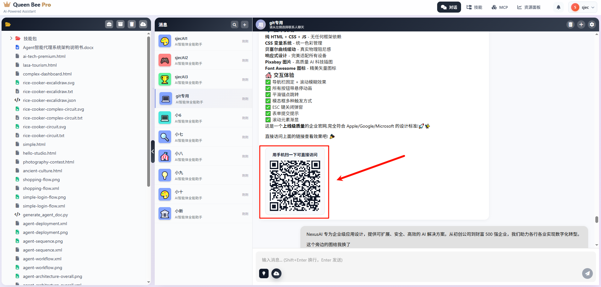
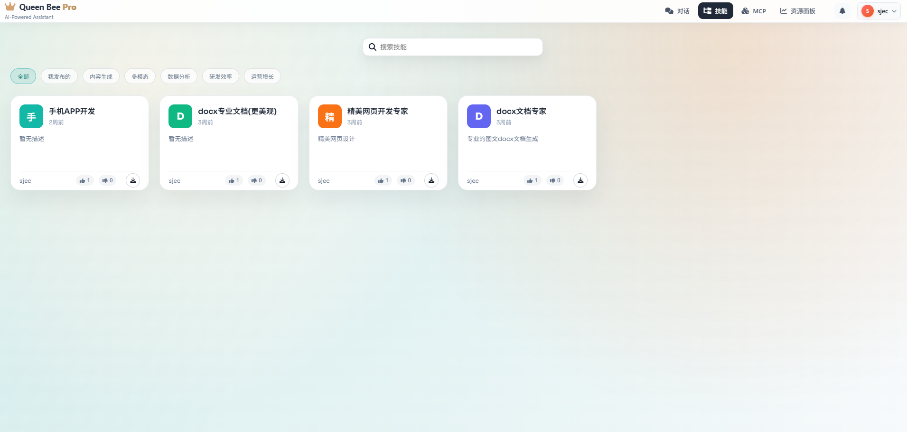

# Queen_Bee / QB_agent

[简体中文](README.md) | [English](README.en.md)

## Overview

🚀 This is a Web-based agent platform built on a Claude agent core. It delivers strong performance and high task completion efficiency, with robust compatibility for complex enterprise workflows. 💰 Hardware costs are kept extremely low: 16GB of memory can support thousands of concurrent users, making it ideal for SMBs that want an intelligent hub across the business without heavy infrastructure spend. 🧠 Compute and hardware costs are dramatically reduced, allowing a 1,000-employee company to operate for just a few hundred to a few thousand RMB per month. ⚙️ Built-in agent reclamation and algorithm optimizations keep hardware cost to a few hundred RMB and compute usage modest, supporting daily work at scale. The outcome is remarkable.

## Features

Driven by AI programming, it provides professional-grade agent capabilities for non-IT users. It supports document and data creation, analysis, and automation, including xlsx analysis and calculation, professional docx writing, beautiful website and software generation, email sending, scheduled tasks, memory, and self-evolution. It also excels in everyday business scenarios: financial analysis, HR resume processing, browser automation, design and illustration, one-click generation and deployment of official websites, complex task handling, proactive task triggers, and a wide range of analyses. The platform supports high concurrency, allowing users to simultaneously run agents, Skills, MCP, and the user control panel. As a high-performance Web product, it requires no installation—just open and use—with extremely light resource consumption. It supports online preview and editing of Office documents, and with just a few words users can generate and analyze documents or even produce and deploy a complete website at high speed.

Core UI (PNG):

- Login screen  
  
- Main screen  
  
- User control panel  
  
- MCP install  
  

Agent-Generated Demos (GIF, click to view):

- [Website generation](doc/images/官网生成.gif)
- [Document generation samples](doc/images/文档生成样例.gif)
- [Module showcase](doc/images/模块展示.gif)
- [Design sketching](doc/images/画设计图.gif)
- [Complex design](doc/images/复杂设计图.gif)
- [Misc generation cases](doc/images/各种生成案例.gif)

## Examples

- [Research-mode example (Google-level quality)](https://queenbeecai.com/html-page/9a2d5f22-57ef-4231-b76d-5cf9dbf90a20/%E5%A4%A7%E6%A8%A1%E5%9E%8B%E5%AD%A6%E4%B9%A0%E8%B5%84%E6%96%99/index.html)
- One-click art website generation  
  
- Professional document generation  
  
- Complex xlsx generation  
  
- Complex graphics for learning  
  
- Complex paper PDF generation  
  
- Website system generation and deployment  
  
- Skills support  
  

## Requirements

- CPU: 4 cores
- Memory: 8 GB
- Disk: 100 GB
- Model (offline deployment): recommended GLM 4.7, around 800 GB VRAM; about 400 GB VRAM with quantization
- Model (non-private deployment): recommended Zhipu AI coding plan or MinMax monthly plan (tens of RMB)
- Multi-user: supports intelligent allocation across multiple API keys for stable compute

## Quick Start

Pull or download the source to your server, fill in #必填1 #必填2 in `agent/backend/core/system/config.py`, then go to the `install` directory and run `start_install.sh` for one-click deployment.

## Configuration

Go to `agent/backend/core/system/config.py` and fill in #必填1 #必填2.

## Technology

- Linux UID/GID and cgroup2
- Bash wrapper sandbox isolation (low memory overhead)
- GLM Coding model driver
- Agent reclamation and algorithm optimizations

## Contributing

- TODO

## License

Apache 2.0

Contact (phone): 17512089424  
WeChat: `queenbeecai`  
Douyin (tutorials occasionally, ID): 77263839168
